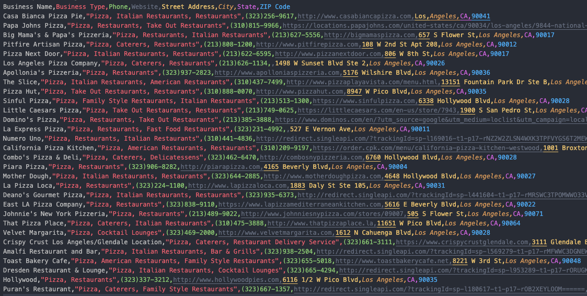

# YellowPages Web Scraper

A Node.js application for scraping business information from YellowPages.com. Available with both command-line and web interfaces, now featuring Firebase authentication and clean URL routing.

## 📋 Features

- **User Authentication**:
  - Firebase email/password login
  - Password reset functionality
  - Protected application routes
  - Clean, pretty URLs (/login, /)
- **Search Capabilities**:
  - Search for businesses by type and location
  - Collect information like:
    - Business names
    - Phone numbers
    - Websites
    - Complete addresses
- **Data Management**:
  - Save results as JSON or CSV files
  - Browse, preview, and manage saved results
  - Mobile-friendly web interface
  - Command-line interface for scripts and automation

## 🔧 Installation

### Standard Installation

1. Clone the repository:
```bash
git clone git@github.com:DevManSam777/yp-scraper-docker.git
cd yp-webscraper-docker
```

2. Install dependencies:
```bash
npm install
```

3. Make sure the output directories exist:
```bash
mkdir -p json_results csv_results
```

### Docker Installation (From Docker Desktop)

1. Clone the repository:
```bash
git clone git@github.com:DevManSam777/yp-scraper-docker.git
cd yp-webscraper-docker
```

2. Run using Docker Compose:
```bash
docker-compose up
```

This will:
- Build the Docker image with all dependencies (including Chrome)
- Create and start the container
- Mount the necessary volumes for file storage
- Map port 3000 to the container

## 🔐 Firebase Authentication Setup

1. Create a Firebase project at [console.firebase.google.com](https://console.firebase.google.com)
2. Enable Email/Password authentication
3. Register a web app in your Firebase project
    - Add users manually from firebase console since we don't want sign ups via web app
4. Update the Firebase configuration in:
   - `public/login.html`
   - `public/index.html` (logout functionality)
5. Add your development and production domains to Firebase authorized domains

## 🚀 Usage

### Command-line Interface

Run the scraper in interactive mode:
```bash
npm run search
```

You'll be prompted to enter:
- What you're looking for (e.g., "pizza")
- Where (e.g., "Los Angeles, CA")
- Number of results to collect
- How to save the results (JSON or CSV)

### Web Interface

1. Start the web server:
```bash
npm start
```

2. Open your browser and go to:
```
http://localhost:3000
```

3. Log in with your Firebase credentials

4. Use the interface to:
   - Configure and start searches
   - Monitor real-time progress
   - View and manage results
   - Preview and download files

## 🌍 Deployment

The application can be deployed to any platform that supports Docker containers:

1. Push your code to a Git repository
2. Deploy the Docker container to your preferred hosting platform
3. Add your deployment domain to Firebase authorized domains

### File Storage Note

When deployed, consider your file storage strategy:
- Docker containers typically use ephemeral storage
- Files may be lost during container restarts or redeployments
- For production, consider:
  - Downloading files immediately after generation
  - Mounting persistent volumes
  - Using cloud storage integrations

## 🌐 Web Interface Features

The web interface provides:

- **Clean URL Routing**: User-friendly URLs without .html extensions:
  - `/login` - Authentication page
  - `/` - Main application (protected)
- **Login Screen**: Secure access to the application
- **Search Tab**: Configure and run searches
- **Results Tab**: View detailed business information
- **Files Tab**: Manage saved JSON and CSV files
- **Real-time Progress**: Monitor search status
- **File Preview**: Quick view of saved results
- **Responsive Design**: Works on mobile devices

## 📊 Output Format

### JSON Example
```json
[
  {
    "businessName": "Pizza Place",
    "businessType": "Pizza, Italian Restaurant",
    "phone": "(555)123-4567",
    "website": "https://example.com",
    "streetAddress": "123 Main St",
    "city": "Los Angeles",
    "state": "CA",
    "zipCode": "90001"
  }
]
```

### CSV Format


Results are saved with the following columns:
- Business Name
- Business Type
- Phone
- Website
- Street Address
- City
- State
- ZIP Code

## ⚠️ Important Notes

- For educational and demonstration purposes only
- Only works with YellowPages.com
- Please refer to YellowPages.com Terms of Service before using
- Might break if the website structure changes
- Use carefully and responsibly
- Use at your own discretion and risk

## 🔒 Limitations

- Limited to ~300 results per search
- VPN recommended for extensive use
- Consider file storage persistence for production deployments

## 🛠️ Customization

- **Port**: Change the web server port by setting the `PORT` environment variable
- **Results Limit**: Modify the maximum results in `puppeteer-scraper-module.js`
- **URL Routing**: The application uses clean URL paths without file extensions

## 🔄 How It Works

The scraper uses Puppeteer with stealth plugins to navigate YellowPages search results and extract business information. The application architecture includes:

- `puppeteer-scraper-module.js`: Core scraper functionality
- `puppeteer-scraper-cli.js`: Command-line interface
- `web-server.js`: Web server & API endpoints with clean URL routing
- `public/index.html`: Web interface
- `public/login.html`: Authentication interface