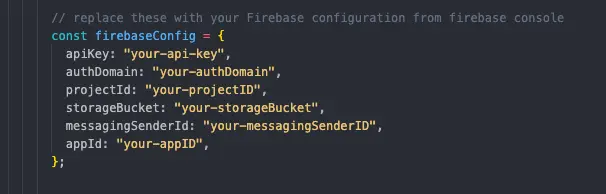
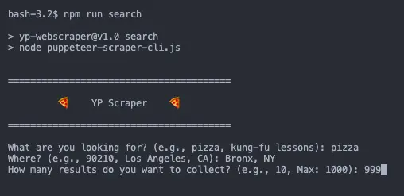
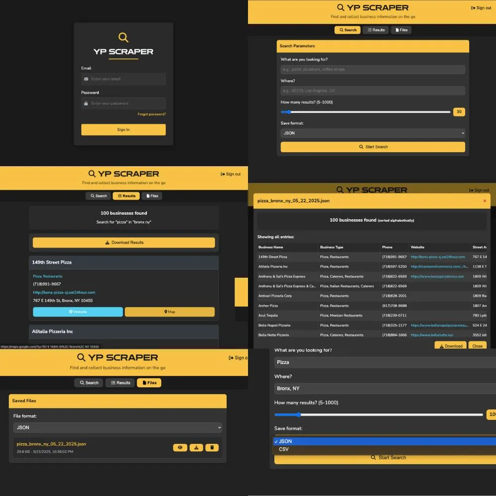
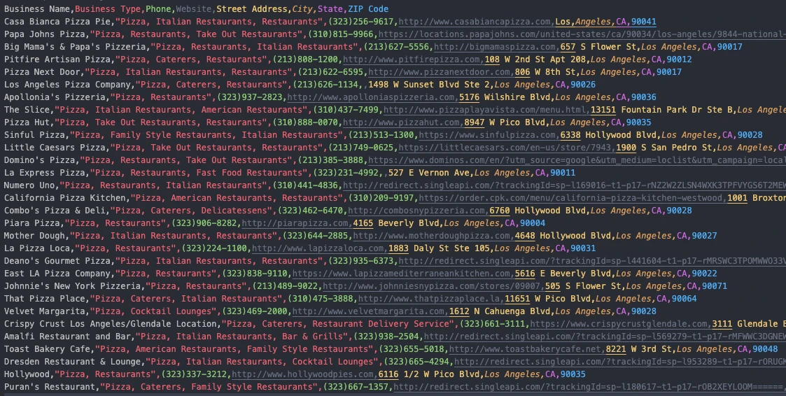

# YP Scraper
A Node.js application for scraping business information from YellowPages.com. Available with both command-line and web interfaces, now featuring Firebase authentication and clean URL routing.

## Table of Contents
- [Features](#-features)
- [Installation](#-installation)
  - [Standard Installation](#standard-installation)
  - [Docker Installation](#docker-installation-from-docker-desktop)
- [Firebase Authentication Setup](#-firebase-authentication-setup)
- [Usage](#-usage)
  - [Command-line Interface](#1-command-line-interface)
  - [Web Interface](#2-web-interface)
- [Deployment](#-deployment)
- [Web Interface Features](#-web-interface-features)
- [Output Format](#-output-format)
- [Important Notes](#-important-notes)
- [Limitations](#-limitations)
- [Customization](#-customization)
- [How It Works](#-how-it-works)
- [License](#-license)

## Features
**User Authentication:**
- Firebase email/password login
- Password reset functionality

**Search Capabilities:**
- Search for businesses by type and location
- Collect information like:
  - Business names
  - Phone numbers
  - Websites
  - Complete addresses

**Data Management:**
- Save results as JSON or CSV files
- Browse, preview, and manage saved results
- Mobile-friendly web interface w/ light and dark themes
- Command-line interface for scripts and automation

## Installation
### Standard Installation
Clone the repository:
```bash
git clone git@github.com:DevManSam777/yp_scraper.git
cd yp-webscraper-docker
```

Install dependencies:
```bash
npm install
```

Make sure the output directories exist:
```bash
mkdir -p json_results csv_results
```

**Note:** You can run the scraper in the command-line without dockerizing or spinning up the server. To get started with CLI scroll down to usage and follow the instructions.

### Docker Installation (From Docker Desktop)
Clone the repository:
```bash
git clone git@github.com:DevManSam777/yp_scraper.git
cd yp-webscraper-docker
```

Run using Docker Compose:
```bash
docker-compose up
```

This will:
- Build the Docker image with all dependencies (including Chrome)
- Create and start the container
- Mount the necessary volumes for file storage
- Map port 3000 to the container

## Firebase Authentication Setup
1. Create a Firebase project at console.firebase.google.com
2. Enable Email/Password authentication
3. Register a web app in your Firebase project
4. Add users manually from firebase console since we don't want sign ups via the web app
5. Update the Firebase configuration (these are public keys that can be safely exposed) in:
   - `public/login.html`
   - `public/index.html` (logout functionality)



 
6. Add your development and production domains to Firebase authorized domains

## Usage
### 1. Command-line Interface (CLI)



Run the scraper in interactive mode:
```bash
npm run search
```

You'll be prompted to enter:
- What you're looking for (e.g., "pizza")
- Where (e.g., "Los Angeles, CA")
- Number of results to collect
- How to save the results (JSON or CSV)

### 2. Web Interface (GUI)



Start the web server:
```bash
npm start
```

Open your browser and go to:
```
http://localhost:3000
```

Log in with your Firebase credentials

Use the interface to:
- Configure and start searches
- Monitor real-time progress
- View and manage results
- Preview and download files

## Deployment

### Deploy to Render (Recommended)
Render offers native support for running containerized apps and services at scale, making it perfect for this Docker-based application.

**Prerequisites:**
- GitHub/GitLab repository with your code
- Firebase project configured for authentication

**Step-by-Step Render Deployment:**

1. **Create Web Service on Render**
   - Go to [render.com](https://render.com) and sign up/login
   - Click "New +" → "Web Service"
   - Choose "Build and deploy from a Git repository"
   - Connect your GitHub/GitLab account
   - Select your YP Scraper repository

2. **Configure Service Settings**
   - **Name:** `yp-scraper` (or your preferred name)
   - **Region:** Choose closest to your users
   - **Branch:** `main` (or your default branch)
   - **Runtime:** Docker (Render auto-detects your Dockerfile)
   - **Build Command:** Leave empty (Docker handles this)
   - **Start Command:** Leave empty (uses Dockerfile CMD)

3. **Set Environment Variables (Optional)**
   - Add any custom environment variables you need
   - `PORT` is automatically set by Render

4. **Configure Firebase**
   - In your Firebase console, add your Render domain to authorized domains
   - Format: `your-app-name.onrender.com`

5. **Deploy**
   - Click "Create Web Service"
   - Render builds your Docker image on every push to your repo, storing the image in a private and secure container registry
   - First deployment takes 5-10 minutes
   - Subsequent deployments are faster due to layer caching

**Important Render Considerations:**

**Free Tier Limitations:**
- Apps sleep after 15 minutes of inactivity (causes ~50 second cold start)
- 750 hours/month of runtime total for ALL projects, not EACH
- No persistent disk storage on free tier

**Recommended:** Upgrade to a paid plan for persistent storage and no sleep mode.

**Free Tier Pro-Tip:** Use [cron-job.org](https://cron-job.org) to send an HTTP request to your app every 10 minutes to prevent it from spinning down due to inactivity (use at your own risk).

**File Storage Strategy:**
Since Render uses ephemeral storage:
- **Generated files (JSON/CSV) are temporary** and lost on restarts
- **Recommended approach:** Users should download files immediately after generation
- **Alternative:** Upgrade to paid plan with persistent disk storage
- **Advanced users:** Link a database to store file metadata and results for persistence

**Automatic Deployments:**
- Every git push to your main branch triggers a new deployment
- Zero-downtime deployments ensure no service interruption

### Deploy to Other Platforms
The application can also be deployed to other Docker-supporting platforms:
- **Railway:** Similar git-based deployment process
- **Fly.io:** Global deployment with static IPs
- **DigitalOcean App Platform:** Managed infrastructure
- **Heroku:** Using container registry deployment

## Web Interface Features
The web interface provides:

- **Clean URL Routing:** User-friendly URLs without .html extensions:
  - `/login` - Authentication page
  - `/` - Main application (protected)
- **Login Screen:** Secure access to the application
- **Search Tab:** Configure and run searches
- **Results Tab:** View detailed business information
- **Files Tab:** Manage saved JSON and CSV files
- **Real-time Progress:** Monitor search status
- **File Preview:** Quick view of saved results
- **Responsive Design:** Works on mobile devices

## Output Format
### JSON Example
```json
[
  {
    "businessName": "Pizza Place",
    "businessType": "Pizza, Italian Restaurant",
    "phone": "(555)123-4567",
    "website": "https://example.com",
    "streetAddress": "123 Main St",
    "city": "Los Angeles",
    "state": "CA",
    "zipCode": "90001"
  }
]
```

### CSV Format



Results are saved with the following columns:
- Business Name
- Business Type
- Phone
- Website
- Street Address
- City
- State
- ZIP Code

## Important Notes
- Neither this application nor it's creator are affiliated in any way, shape, or form with Yellowpages.com
- For educational and demonstration purposes only
- Only works with YellowPages.com
- Please refer to YellowPages.com Terms of Service before using
- Might break if the website structure changes
- Use carefully and responsibly
- Use at your own discretion and risk

## Limitations
- Limited to ~1000 results per search
- Rotating proxies recommended for extensive use
- Consider file storage persistence for production deployments

## Customization
- **Port:** Change the web server port by setting the PORT environment variable
- **Results Limit:** Modify the maximum results in `puppeteer-scraper-module.js` and adjust UI values in `public/app/index.html`
- **URL Routing:** The application uses clean URL paths without file extensions

## How It Works
The scraper uses Puppeteer with stealth plugins to navigate YellowPages search results and extract business information. The application architecture includes:

- `puppeteer-scraper-module.js`: Core scraper functionality
- `puppeteer-scraper-cli.js`: Command-line interface
- `web-server.js`: Web server & API endpoints with clean URL routing
- `public/index.html`: Web interface
- `public/login.html`: Authentication interface

## License
This project is licensed under the MIT License - see the [LICENSE](LICENSE) file for details.